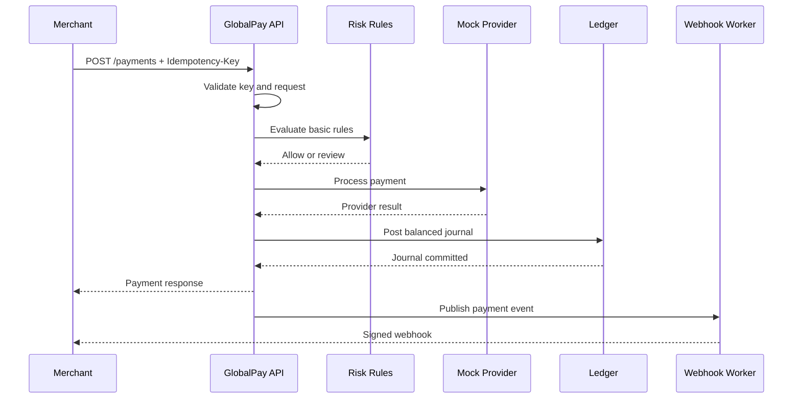

# Payment Flow

```mermaid
sequenceDiagram
    participant M as Merchant
    participant API as GlobalPay API
    participant R as Risk Rules
    participant P as Mock Provider
    participant L as Ledger
    participant W as Webhook Worker

    M->>API: POST /payments + Idempotency-Key
    API->>API: Validate key and request
    API->>R: Evaluate basic rules
    R-->>API: Allow or review
    API->>P: Process payment
    P-->>API: Provider result
    API->>L: Post balanced journal
    L-->>API: Journal committed
    API-->>M: Payment response
    API->>W: Publish payment event
    W-->>M: Signed webhook
```
