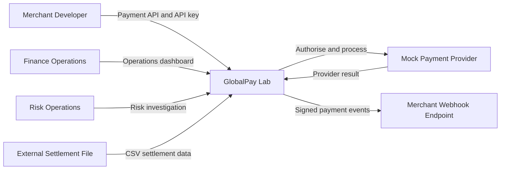

# System Context

## Platform responsibility

GlobalPay Lab owns:

- payment intent and lifecycle;
- internal wallet and ledger records;
- idempotency;
- provider orchestration;
- webhook delivery history;
- settlement batches;
- reconciliation results;
- risk and audit records.
